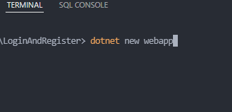

### Projeto login e register 
Abra o visual studio code e no terminal siga os passos:  
1° dotnet new webapp  
2° instalar os pacotes  
    

          
    

    

        Adicione os pacotes necessários para a utilização do banco de dados sqlserver.
    

    

         dotnet add package Microsoft.EntityFrameworkCore.Tools 
         dotnet add package Microsoft.EntityFrameworkCore. 
    

  
###	SqlServer e string de conexão
Crie a string de conexão utilizando bloco de notas e sqlmanager
##### 1° Abra o sqlserver manager e copie 
Confira nesse link como criar uma string de conexão [String de Conexao](https://www.youtube.com/watch?v=fZnEVPdjcic)